# ExpenseFlow 💜

A full-stack personal expense tracker with real-time budgeting, analytics, and a glassmorphism UI. Built to track income and expenses, set monthly and category-wise budgets, and visualize spending patterns, all backed by a secure, multi-user authentication system.

---

## ✨ Features

- **Authentication**: Secure signup/login with JWT-based sessions and bcrypt password hashing
- **Transaction Management**: Full CRUD (add, edit, delete) for income and expense entries
- **Smart Filtering & Sorting**: Filter by type, category, or search term; sort by date or amount
- **Budgets**: Overall monthly limit plus category-wise budgets, with live progress bars and over-budget warnings
- **Analytics**: Category-wise spending (doughnut chart) and income vs. expense comparison (bar chart) using Chart.js
- **Multi-User Support**: Every user has an isolated account; all data is scoped to the logged-in user
- **Data Export**: Download transaction history
- **Glassmorphism UI**: Custom design system with blur effects, soft gradients, and smooth animations
- **Toast Notifications**: Non-blocking success/error feedback across the app

---

## 🛠️ Tech Stack

**Frontend**
- HTML5, CSS3 (custom glassmorphism design system)
- Vanilla JavaScript
- [Chart.js](https://www.chartjs.org/) for data visualization
- [Lucide Icons](https://lucide.dev/) for icons

**Backend**
- Node.js + Express.js
- PostgreSQL (Supabase)
- JWT (`jsonwebtoken`) for authentication
- `bcryptjs` for password hashing

---

## 🏗️ Architecture

```mermaid
%% Generated by https://gitdiagram.com/kanishka373/expense-flow
flowchart TD

subgraph group_frontend["Browser experience"]
  node_auth_ui["Sign in<br/>[auth.js]"]
  node_dashboard["Dashboard<br/>[dashboard.js]"]
  node_transactions_ui["Transactions<br/>[transactions.js]"]
  node_add_transaction_ui["Add transactions"]
  node_budgets_ui["Budgets<br/>[budgets.js]"]
  node_analytics_ui["Analytics<br/>[analytics.js]"]
  node_settings_ui["Settings and export<br/>[settings.js]"]
  node_notifications["Toast feedback<br/>[toast.js]"]
end

subgraph group_api["API and identity"]
  node_api_server["Express API<br/>[server.js]"]
  node_auth_middleware["JWT validation<br/>[authMiddleware.js]"]
  node_transaction_routes["Transaction routes"]
  node_budget_routes["Budget routes<br/>[budgetRoutes.js]"]
  node_analytics_routes["Analytics routes<br/>[analyticsRoutes.js]"]
end

subgraph group_finance["Finance features"]
  node_transaction_logic["Transaction management"]
  node_budget_logic["Budget tracking"]
  node_analytics_logic["Spending analytics"]
  node_account_data["Accounts and export<br/>[server.js]"]
end

subgraph group_persistence["Data persistence"]
  node_pool["PostgreSQL pool<br/>[db.js]"]
  node_postgres[("PostgreSQL database")]
end

node_user(("User"))

node_user -->|"signs in"| node_auth_ui
node_user -->|"tracks finances"| node_dashboard
node_user -->|"manages entries"| node_transactions_ui
node_user -->|"sets budgets"| node_budgets_ui
node_user -->|"reviews spending"| node_analytics_ui
node_user -->|"manages account"| node_settings_ui
node_auth_ui -->|"uses API"| node_api_server
node_dashboard -->|"uses API"| node_api_server
node_transactions_ui -->|"uses API"| node_api_server
node_add_transaction_ui -->|"uses API"| node_api_server
node_budgets_ui -->|"uses API"| node_api_server
node_analytics_ui -->|"uses API"| node_api_server
node_settings_ui -->|"uses API"| node_api_server
node_api_server -->|"mounts routes"| node_transaction_routes
node_api_server -->|"mounts routes"| node_budget_routes
node_api_server -->|"mounts routes"| node_analytics_routes
node_transaction_routes -->|"guards routes"| node_auth_middleware
node_budget_routes -->|"guards routes"| node_auth_middleware
node_analytics_routes -->|"guards routes"| node_auth_middleware
node_transaction_routes -->|"dispatches to"| node_transaction_logic
node_budget_routes -->|"dispatches to"| node_budget_logic
node_analytics_routes -->|"dispatches to"| node_analytics_logic
node_api_server -->|"guards account APIs"| node_auth_middleware
node_transaction_logic -->|"queries"| node_pool
node_budget_logic -->|"queries"| node_pool
node_analytics_logic -->|"queries"| node_pool
node_api_server -->|"queries account data"| node_pool
node_pool -->|"connects to"| node_postgres

click node_auth_ui "https://github.com/kanishka373/expense-flow/blob/main/frontend/js/auth.js"
click node_dashboard "https://github.com/kanishka373/expense-flow/blob/main/frontend/js/dashboard.js"
click node_transactions_ui "https://github.com/kanishka373/expense-flow/blob/main/frontend/js/transactions.js"
click node_add_transaction_ui "https://github.com/kanishka373/expense-flow/blob/main/frontend/js/add-transactions.js"
click node_budgets_ui "https://github.com/kanishka373/expense-flow/blob/main/frontend/js/budgets.js"
click node_analytics_ui "https://github.com/kanishka373/expense-flow/blob/main/frontend/js/analytics.js"
click node_settings_ui "https://github.com/kanishka373/expense-flow/blob/main/frontend/js/settings.js"
click node_notifications "https://github.com/kanishka373/expense-flow/blob/main/frontend/js/toast.js"
click node_api_server "https://github.com/kanishka373/expense-flow/blob/main/backend/server.js"
click node_auth_middleware "https://github.com/kanishka373/expense-flow/blob/main/backend/middleware/authMiddleware.js"
click node_transaction_routes "https://github.com/kanishka373/expense-flow/blob/main/backend/routes/transactionRoutes.js"
click node_budget_routes "https://github.com/kanishka373/expense-flow/blob/main/backend/routes/budgetRoutes.js"
click node_analytics_routes "https://github.com/kanishka373/expense-flow/blob/main/backend/routes/analyticsRoutes.js"
click node_transaction_logic "https://github.com/kanishka373/expense-flow/blob/main/backend/controllers/transactionControllers.js"
click node_budget_logic "https://github.com/kanishka373/expense-flow/blob/main/backend/controllers/budgetControllers.js"
click node_analytics_logic "https://github.com/kanishka373/expense-flow/blob/main/backend/controllers/analyticsControllers.js"
click node_account_data "https://github.com/kanishka373/expense-flow/blob/main/backend/server.js"
click node_pool "https://github.com/kanishka373/expense-flow/blob/main/backend/db.js"

classDef toneNeutral fill:#f8fafc,stroke:#334155,stroke-width:1.5px,color:#0f172a
classDef toneBlue fill:#dbeafe,stroke:#2563eb,stroke-width:1.5px,color:#172554
classDef toneAmber fill:#fef3c7,stroke:#d97706,stroke-width:1.5px,color:#78350f
classDef toneMint fill:#dcfce7,stroke:#16a34a,stroke-width:1.5px,color:#14532d
classDef toneRose fill:#ffe4e6,stroke:#e11d48,stroke-width:1.5px,color:#881337
classDef toneIndigo fill:#e0e7ff,stroke:#4f46e5,stroke-width:1.5px,color:#312e81
classDef toneTeal fill:#ccfbf1,stroke:#0f766e,stroke-width:1.5px,color:#134e4a
class node_auth_ui,node_dashboard,node_transactions_ui,node_add_transaction_ui,node_budgets_ui,node_analytics_ui,node_settings_ui,node_notifications,node_user toneBlue
class node_api_server,node_auth_middleware,node_transaction_routes,node_budget_routes,node_analytics_routes toneAmber
class node_transaction_logic,node_budget_logic,node_analytics_logic,node_account_data toneMint
class node_pool,node_postgres toneRose
```


---

## 📂 Project Structure

```
expenseflow/
├── backend/
│   ├── controllers/
│   ├── middleware/
│   ├── routes/
│   ├── db.js
│   ├── server.js
│   └── .env              (not committed)
│
└── frontend/
    ├── css/
    ├── js/
    ├── login.html
    ├── dashboard.html
    ├── add-transactions.html
    ├── transactions.html
    ├── budgets.html
    ├── analytics.html
    └── settings.html
```

---

## 🚀 Getting Started

### Prerequisites
- Node.js (v18+)
- A PostgreSQL database (for example, a free [Supabase](https://supabase.com/) project)

### 1. Clone the repo
```bash
git clone https://github.com/<your-username>/expenseflow.git
cd expenseflow
```

### 2. Backend setup
```bash
cd backend
npm install
```

Create a `.env` file inside `backend/`:
```env
DATABASE_URL=your_postgresql_connection_string
JWT_SECRET=your_long_random_secret_string
```

Start the server:
```bash
node server.js
```
The backend runs on `https://expense-flow-58wi.onrender.com`.

### 3. Database setup
Create the `users`, `transactions`, and `budgets` tables in your PostgreSQL database.

### 4. Frontend setup
Open `frontend/login.html` using a live server (for example, the VS Code Live Server extension). No build step is required.

> **Note:** API calls in the frontend JS files point to `https://expense-flow-58wi.onrender.com`. When deploying, replace this with your deployed backend URL.

---

## 🔐 Environment Variables

| Variable | Description |
|---|---|
| `DATABASE_URL` | PostgreSQL connection string |
| `JWT_SECRET` | Secret used to sign JWT tokens |

---

## 🗺️ Roadmap


- [ ] Monthly report view
- [ ] Dark mode
- [ ] Recurring transactions

---

## 👤 Author

Built by **Kanishka**